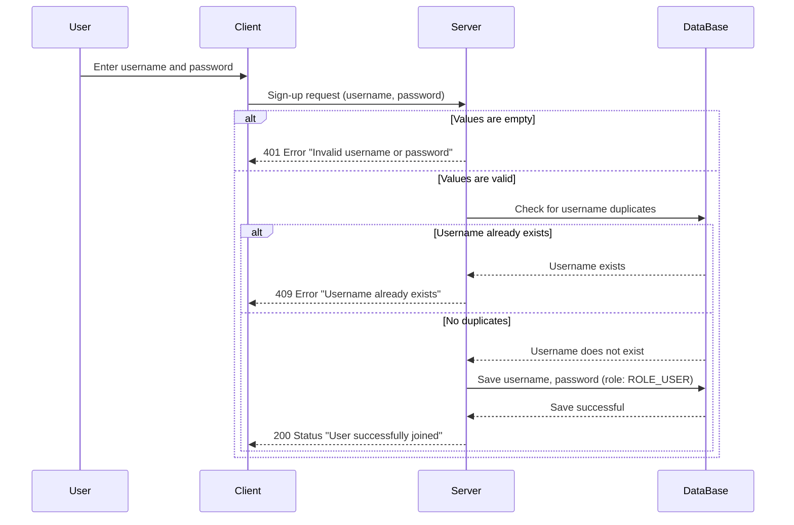

## [Auth] Sign Up Logic Sequence Diagram [test]

```mermaid
sequenceDiagram
    participant U as User
    participant C as Client
    participant S as Server
    participant D as DataBase

    U ->> C: Enter username and password
    C ->> S: Sign-up request (username, password)

    alt Values are empty
        S -->> C: 401 Error "Invalid username or password"
    else Values are valid
        S ->> D: Check for username duplicates
        alt Username already exists
            D -->> S: Username exists
            S -->> C: 409 Error "Username already exists"
        else No duplicates
            D -->> S: Username does not exist
            S ->> D: Save username, password (role: ROLE_USER)
            D -->> S: Save successful
            S -->> C: 200 Status "User successfully joined"
        end
    end

```